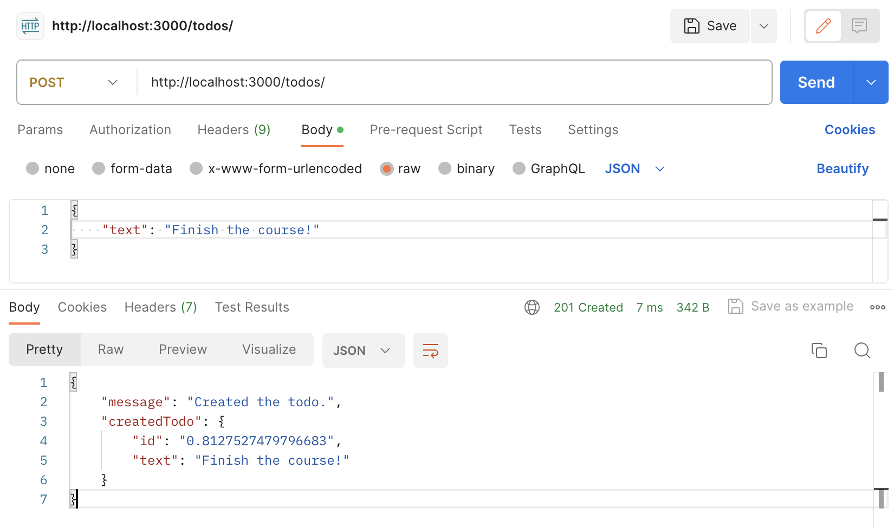

## Node.js Express TypeScript ToDo Application Models

#`ToDo` application frameworks, libraries, languages and database:
`ExpressJS` - creates a REST API
`Node.js` is used as the runtime environment
`TypeScript` programming language
`MongoDB` can be used as the database.

#Tools and technologies used:
`Postman` - REST API testing

